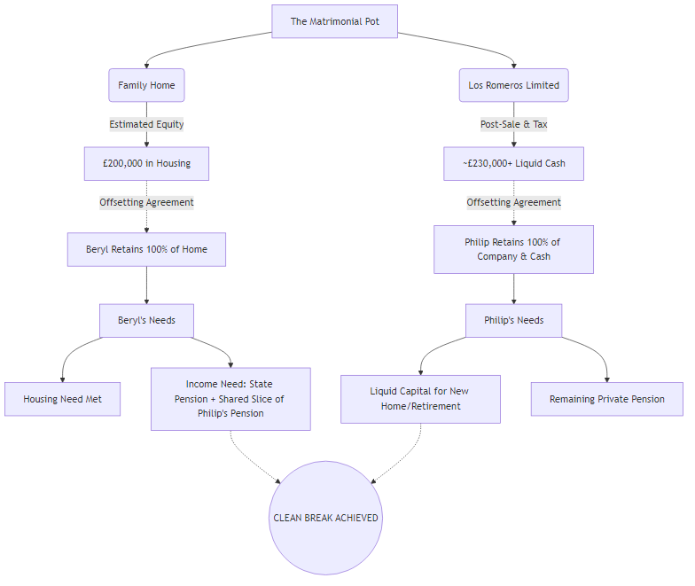

# Confidential Financial & Divorce Settlement Report: Philip Harrison

**Date:** 31 March 2026
**Subject:** Asset Division & Offsetting Strategy for Later-Life Divorce
**Entities:** Philip Harrison, Beryl Harrison, Los Romeros Limited (No. 06993349)

> [!IMPORTANT]
> **Executive Summary:** Your parents are facing a "later life" divorce with no dependents and no future earning capacity. The court's primary objective will be ensuring both have a secure home and enough income to survive retirement, ideally through a "clean break." The existence of two major, distinct capital assets—the jointly-owned £200k UK property and the liquid cash inside Los Romeros Limited from the €315k Lanzarote sale—makes achieving this clean break highly feasible via **offsetting**.

---

## 1. The Matrimonial Asset Pool

In a UK divorce, all assets built up during the marriage are considered part of the "matrimonial pot," regardless of whose name is on the deed or the share certificate. 

Based on the files from the Los Romeros forensic workspace, the primary capital assets are:

1.  **The UK Family Home:** 
    *   Jointly owned.
    *   Estimated net equity: **£200,000**.
    *   Asset type: Highly secure, illiquid (housing).
2.  **Los Romeros Limited (The Lanzarote Proceeds):** 
    *   Philip is the named Director.
    *   Following the Lanzarote sale for €315,000, settling Spanish CGT (~€18,783), and extracting the funds via a Members' Voluntary Liquidation (MVL), Philip will receive a substantial liquid capital payout (estimated in the region of **£230,000 - £250,000** net of MVL and CGT costs).
    *   This includes the tax-free return of Philip's £25,069 Director's Loan.
    *   Asset type: Liquid cash (post-MVL).
3.  **Pensions & Savings:**
    *   Any private/workplace pensions and other bank accounts will also be added to this pot.

## 2. The Impact of "Later Life" Divorce Principles

Because Philip and Beryl are retired, UK family courts apply different priorities than they would for a younger working couple:

*   **No Earning Capacity:** They cannot easily work to earn more money or secure new mortgages. The capital assets they hold right now must fund the rest of their lives.
*   **Housing is Paramount:** The court will not allow either party to be made homeless. 
*   **A "Clean Break" is Favored:** The court prefers to divide physical assets and cash completely so the couple is permanently severed, rather than ordering one to pay the other an ongoing monthly allowance.

## 3. The "Offsetting" Solution

The current financial picture provides a near-perfect scenario for **Offsetting**. Because the two primary assets are roughly equal in value, a clean break can be negotiated without forcing the sale of either underneath them.

> [!TIP]
> **Proposed Structure for Negotiation:**
> *   **Beryl retains 100% of the UK Family Home.** She removes Philip's name from the deed. She gains housing security for the rest of her life (£200,000 value).
> *   **Philip retains 100% of Los Romeros Limited and its cash proceeds.** Beryl signs away any claim to the company shares or the MVL extraction. Philip gains ~£230,000+ in liquid cash to purchase a new property for himself or fund his retirement.

**Why this works:**
It perfectly addresses the court's goals. Beryl's housing need is met immediately. Philip receives liquid capital to secure his own housing. The clean break is achieved instantly. 

### Visual Offsetting Flowchart

Below is a visual map of how this strategy works to secure the clean break:

## 4. Income, Pensions & The "Needs" Principle

Because Beryl worked most of her life (as a professional figure skater and field sales rep), she is almost certainly entitled to a full UK State Pension (currently ~£11,500/year). However, her modest final salary (£15,000 - £18,000) suggests she holds very little, if any, substantial private pension provision.

In UK family law, the court applies the **"Needs Principle."** They will not approve an offsetting agreement (like her keeping the house) if it leaves her unable to afford basic living costs like council tax, heating, and food. A State Pension alone is rarely sufficient to run a house. 

*   **Pension Sharing:** To ensure Beryl can afford to live without relying on your dad every month, the court will likely look to his pensions. Your dad's solicitor should expect the court to order a **Pension Sharing Order**. This carves out a percentage of Philip's private or workplace pensions and transfers it into a new, independent pension fund for Beryl to draw an income from.
*   **Securing the Clean Break:** Giving up a slice of pension isn't ideal for Philip, but it is a highly strategic move. By satisfying the court that Beryl's monthly "Needs" are met through her State Pension plus a shared slice of his pension, the court will approve the clean break. This guarantees no ongoing Spousal Maintenance payments.

## 5. Addressing Beryl's Alcoholism & Deliberate Dissipation of Assets

You mentioned that Beryl is a closet alcoholic and her excessive spending is often deliberate, designed specifically to diminish the financial pot and adversely affect the divorce outcome. This changes the legal and strategic approach significantly.

*   **Financial Misconduct ("Add-Back" Strategy):** In UK family law, general overspending is rarely penalized. However, **"wanton or reckless dissipation of assets"** is a major exception. If Beryl is intentionally spending out of spite to deplete the matrimonial pot, Philip's solicitor can argue for an "add-back." This means the court calculates the final split as if she *hadn't* spent that money, directly reducing her share of the remaining assets to compensate for the cash she deliberately wasted.
*   **Mental Capacity & Consent:** If Beryl is frequently under the influence, it raises critical legal issues regarding her "capacity" to agree to a financial settlement. A solicitor must ensure any final consent order is legally watertight and cannot be later challenged by her claiming she was intoxicated when she agreed to it.
*   **Strategic Protection:** The offsetting strategy is the ultimate defense against this behavior. Allowing someone with an alcohol dependency and malicious spending tendencies access to liquid cash is highly dangerous. By forcing her to take her share via the *house* (an illiquid asset that is hard to squander quickly), Philip protects the Lanzarote *cash* completely for himself and limits her ability to inflict further financial damage.

> [!CAUTION]
> **Immediate Action Required to Freeze Joint Access:**
> Because there is a proven risk of malicious, spiteful spending, Philip must act immediately. Most importantly, he must ensure he is the **sole signatory** on the Los Romeros Limited UK bank account where the €315,000 sale proceeds will land. He must explicitly revoke any mandates that would allow his wife access to this cash while the divorce is being finalized.

## 6. Next Steps for Philip

1.  **Do NOT Finalize the MVL Yet:** Philip should immediately instruct an independent Family Law Solicitor and explain the situation. He should ask whether he should leave the cash safely locked inside Los Romeros Limited until the financial consent order is signed by the judge, or whether he should proceed with the MVL extraction now.
2.  **Assemble Documents:** Bring the Los Romeros Accounts, the Spanish CGT Forensic Report, and a valuation of the UK family home to the initial solicitor meeting.
3.  **Pension Valuations:** Request "Cash Equivalent Transfer Values" (CETVs) for all pensions held by both Philip and Beryl, as these must be factored into the final offsetting math.

---
*Disclaimer: This report synthesizes existing workspace data with UK family law principles. It is for strategic planning purposes only and does not constitute formal legal advice. Philip must engage a qualified UK family solicitor to ratify any settlement.*
